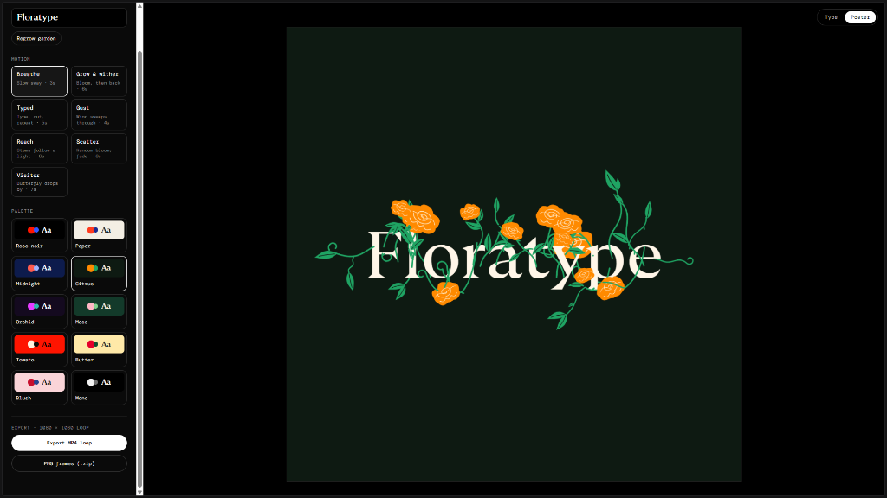
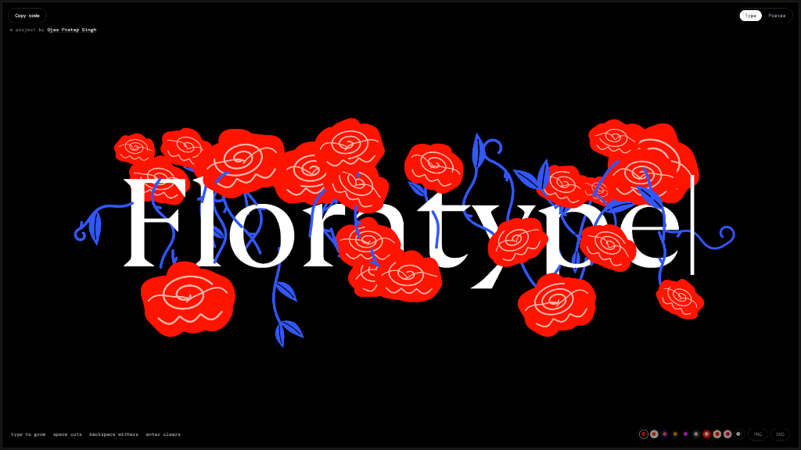
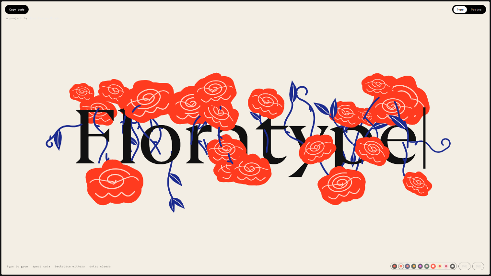
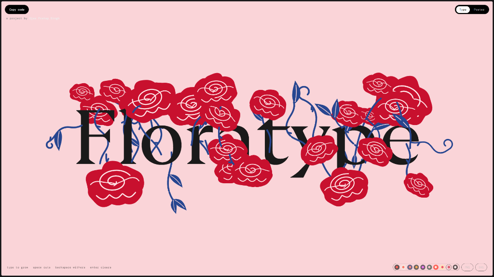
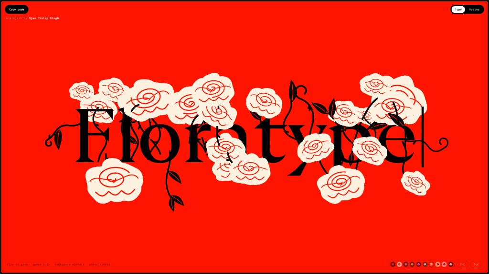
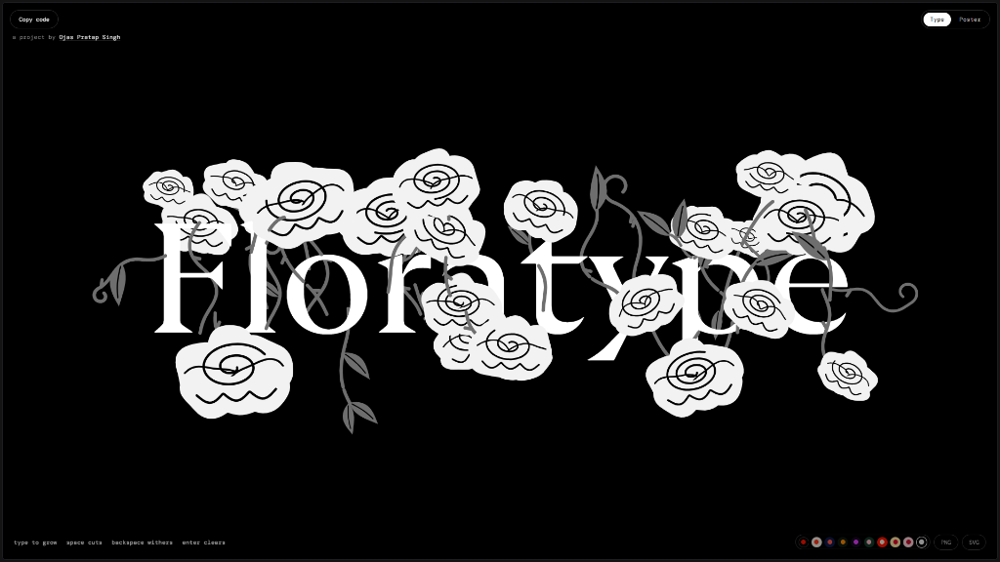

<div align="center">

# 🌸 Floratype
### An Interactive Generative Kinetic Typography Garden

[](https://floratype.vercel.app/)
[](LICENSE)
[](https://github.com/thunderbolt66-wav)

<br/>

> **"Type, and a garden grows from your letters.**  
> **Space cuts the stems, backspace withers them."**

<br/>


</div>

---

## 🏛️ Poster Mode & Kinetic Video Export

Floratype includes a full-featured **Poster Mode Studio** designed for designers, motion artists, and typographers to choreograph procedural plant life and export animated videos:

<div align="center">
  
</div>

### 🎬 Cinema-Grade MP4 Export & Motion Loops
Transform live kinetic typography into high-definition looped video files directly in the browser:
- **`Export MP4 loop`**: Renders a perfect **1080 × 1080 square format** seamless kinetic animation at 60 FPS, ready for Instagram, X, digital signage, and motion portfolios.
- **`PNG frames (.zip)`**: Export every rendered frame as individual lossless PNGs for compositing in After Effects, Premiere, or Blender.

### 🌊 Choreographed Motion Presets
Customize the organic behavior of the flora with curated kinetic simulations:
- **Breathe**: Gentle harmonic sway with slow-motion line-boil dynamics (`2s`).
- **Grow & Wither**: Full botanical lifecycle from seed bloom to decay (`6s`).
- **Typed**: Simulates dynamic human keystrokes, automatic branch slicing, and regrowth (`6s`).
- **Gust**: Turbulent wind sweeps across the canvas, bending stems and scattering petals (`4s`).
- **Reach**: Stems dynamically track and lean toward virtual light sources (`8s`).
- **Scatter**: Organic random-bloom distribution across letterforms with graceful fading (`6s`).
- **Visitor**: A delicate procedural butterfly visits and pollinates the blossoms (`7s`).

### 🎨 Expanded Palette System
Switch dynamically between rich editorial palettes:
- **Rose Noir** (Obsidian & Crimson)
- **Paper** (Cream & Cobalt)
- **Midnight** (Deep Sapphire)
- **Citrus** (Forest Green & Tangerine)
- **Orchid** (Plum & Lilac)
- **Moss** (Sage & Emerald)
- **Tomato** (Vermilion & Cream)
- **Butter** (Warm Ochre)
- **Blush** (Pale Rose & Ruby)
- **Mono** (Silver & Charcoal)

---

## 🎨 Gallery: Real-Time Color Atmospheres

<div align="center">

### 1. Rose Noir (Default Obsidian & Crimson)


### 2. Gardenia (Parchment & Electric Flora)


### 3. Hydrangea (Petal Blush & Ruby Vines)


### 4. Scarlet Marigold (High-Contrast Vermilion)


### 5. Monochrome Noir (Ink & Silver Flora)


</div>

---

## 🌿 Overview

**Floratype** is an experimental generative web experience where letterforms become organic soil. As you type, procedural bezier stems and blooming botanical roses dynamically germinate from the contours of your letters in real time. 

Designed with an obsession for micro-interactions, responsive typography, and tactile physics, Floratype bridges the discipline of classical editorial print typography with fluid, living digital kinetic art.

---

## 🌟 Interactive Mechanics & Physics

| Action | Botanical Response | Kinetic Mechanic |
| :--- | :--- | :--- |
| **Typing a Letter** | Stems sprout and flowers bloom | Procedural bezier spine curve generation seeded from glyph baseline anchor points |
| **Spacebar** | Vines are sliced cleanly | Cuts the continuous stem, isolating the bouquet and beginning a new branch |
| **Backspace** | Blooms and vines wither | Time-decay withering curve gracefully collapses petals back into dormancy |
| **Mouse / Touch Drag** | Flora leans toward pointer | Vector gravitational field pulls surrounding blooms and stems toward the cursor |
| **Enter** | Garden reset & clear | Smooth canvas flush ready for new growth |

---

## 🖋️ Typography & Visual Craftsmanship

- **GT Ultra (Variable OpenType)**: Monumental, sculptural serif weights (100–900) providing anchor geometry for stem growth.
- **Playfair Display**: Romantic high-contrast editorial serifs for refined delicate flourishes.
- **DM Mono**: Utilitarian monospace metadata labels and HUD control coordinates (`letter-spacing: 0.04em`).
- **Obsidian Stage (`#000000`)**: Deep black contrast amplifying vivid crimson petals, delicate rose accents, and electric cobalt stems.

---

## 🚀 Live Access & Local Setup

### Live Production
Access the live deployment on Vercel:
👉 **[https://floratype.vercel.app/](https://floratype.vercel.app/)**

### Run Locally

1. **Clone the repository:**
   ```bash
   git clone https://github.com/thunderbolt66-wav/floratype.git
   cd floratype
   ```

2. **Start the local server:**
   ```bash
   node server.js
   ```

3. **Open in your browser:**
   - Desktop: [http://localhost:3000](http://localhost:3000)
   - Mobile: Navigate to `http://<your-lan-ip>:3000` on the same Wi-Fi network.

---

## 🛠️ Architecture & Tech Stack

```
floratype/
├── index.html           # Self-contained reactive generative engine & canvas shaders
├── server.js            # Zero-dependency local Node.js development server
├── source.txt           # Clean bundled engine source code
├── og.png               # High-resolution social graph banner (Floratype UI)
├── screenshots/         # Curated UI & Studio screenshots (Poster Mode, Palettes)
├── favicon.svg          # Botanical vector favicon
├── favicon.ico          # Legacy multi-resolution icon
├── apple-touch-icon.png # iOS home screen icon
└── README.md            # Dedicated documentation page
```

- **Canvas Pipeline**: Hardware-accelerated 2D Canvas context with 60 FPS `requestAnimationFrame` render loop.
- **Video Renderer**: In-browser media recording encoding 1080×1080 canvas animations to seamless `.mp4` video loops.
- **Procedural Engine**: Trigonometric curve solvers with seeded pseudo-random leaf clustering.
- **Mobile Touch**: Coarse pointer event listener (`pointerdown`, `pointermove`, `pointerup`) + predictive input diffing for mobile virtual keyboards.

---

## 👤 Author & Credits

**Project by Ojas Pratap Singh**  
- GitHub: [@thunderbolt66-wav](https://github.com/thunderbolt66-wav)
- Live Project: [https://floratype.vercel.app/](https://floratype.vercel.app/)

---

<div align="center">
<sub>Crafted with passion for typography, procedural graphics, and web craftsmanship.</sub>
</div>
