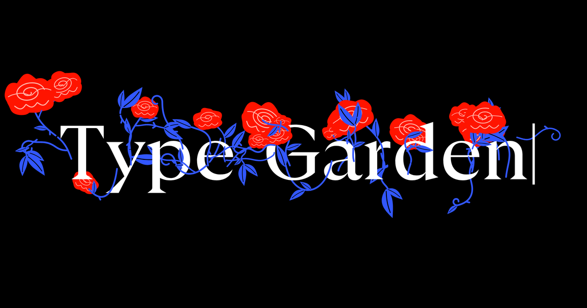

<div align="center">

# 🌸 Floratype
### An Interactive Generative Kinetic Typography Garden

[](https://floratype.vercel.app/)
[](LICENSE)
[](https://github.com/thunderbolt66-wav)

<br/>

> **"Type, and a garden grows from your letters.**  
> **Space cuts the stems, backspace withers them."**

<br/>



</div>

---

## 🌿 Overview

**Floratype** is an experimental generative web experience where letterforms become organic soil. As you type, procedural bezier stems and blooming botanical roses dynamically germinate from the contours of your letters in real time. 

Designed with an obsession for micro-interactions, responsive typography, and tactile physics, Floratype bridges the discipline of classical editorial print typography with fluid, living digital kinetic art.

---

## 🌟 Interactive Mechanics & Physics

| Action | Botanical Response | Kinetic Mechanic |
| :--- | :--- | :--- |
| **Typing a Letter** | Stems sprout and flowers bloom | Procedural bezier spine curve generation seeded from glyph baseline anchor points |
| **Spacebar** | Vines are sliced cleanly | Cuts the continuous stem, isolating the bouquet and beginning a new branch |
| **Backspace** | Blooms and vines wither | Time-decay withering curve gracefully collapses petals back into dormancy |
| **Mouse / Touch Drag** | Flora leans toward pointer | Vector gravitational field pulls surrounding blooms and stems toward the cursor |
| **Enter** | Garden reset & clear | Smooth canvas flush ready for new growth |

---

## 🎨 Dual Experience Modes

### 1. 🪷 Type Mode (Minimalist Fullscreen)
- **Zero Distraction**: Immersive void-black canvas centered purely on typing and botanical bloom.
- **Adaptive Typography**: Text auto-scales and word-wraps dynamically to maintain headroom for the overarching garden above and below.
- **Responsive Soft Keyboard**: Leverages the modern `visualViewport` API (`--tg-top`, `--tg-h`) to fluidly adapt without layout shifts as virtual keyboards slide up on iOS Safari and Android Chrome.

### 2. 🏛️ Poster Mode (Editorial Design Studio)
- **Palette Presets**: Curated botanical color palettes including *Rose Noir*, *Gardenia*, *Marigold*, *Hydrangea*, and *Monochrome*.
- **Motion Physics Tuning**:
  - **Line Boiling**: Toggle organic hand-drawn boiling line jitter powered by sinusoidal harmonics.
  - **Recoil Intensity**: Adjust spring-damper velocity bounce on stems during typing.
  - **Density Scale**: Control foliage fullness and branching frequency per glyph.
- **Vector & High-Res Export**:
  - Download high-DPI **PNG** posters for digital display.
  - Export lossless, scalable **SVG** vectors suitable for print and plotter machines.

---

## 🖋️ Typography & Visual Craftsmanship

- **GT Ultra (Variable OpenType)**: Monumental, sculptural serif weights (100–900) providing anchor geometry for stem growth.
- **Playfair Display**: Romantic high-contrast editorial serifs for refined delicate flourishes.
- **DM Mono**: Utilitarian monospace metadata labels and HUD control coordinates (`letter-spacing: 0.04em`).
- **Void Obsidian Stage (`#000000`)**: Deep black contrast amplifying vivid crimson petals (`#FF1400`), delicate rose accents (`#FFB4A8`), and electric cobalt stems (`#3257FF`).

---

## 🚀 Live Access & Local Setup

### Live Production
Access the live deployment on Vercel:
👉 **[https://floratype.vercel.app/](https://floratype.vercel.app/)**

### Run Locally

1. **Clone the repository:**
   ```bash
   git clone https://github.com/thunderbolt66-wav/floratype.git
   cd floratype
   ```

2. **Start the local server:**
   ```bash
   node server.js
   ```

3. **Open in your browser:**
   - Desktop: [http://localhost:3000](http://localhost:3000)
   - Mobile: Navigate to `http://<your-lan-ip>:3000` on the same Wi-Fi network.

---

## 🛠️ Architecture & Tech Stack

```
floratype/
├── index.html           # Self-contained reactive generative engine & canvas shaders
├── server.js            # Zero-dependency local Node.js development server
├── source.txt           # Clean bundled engine source code
├── og.png               # High-resolution social graph banner
├── favicon.svg          # Botanical vector favicon
├── favicon.ico          # Legacy multi-resolution icon
├── apple-touch-icon.png # iOS home screen icon
└── README.md            # Dedicated documentation page
```

- **Canvas Pipeline**: Hardware-accelerated 2D Canvas context with 60 FPS `requestAnimationFrame` render loop.
- **Procedural Engine**: Trigonometric curve solvers with seeded pseudo-random leaf clustering.
- **Mobile Touch**: Coarse pointer event listener (`pointerdown`, `pointermove`, `pointerup`) + predictive input diffing for mobile virtual keyboards.

---

## 👤 Author & Credits

**Project by Ojas Pratap Singh**  
- GitHub: [@thunderbolt66-wav](https://github.com/thunderbolt66-wav)
- Live Project: [https://floratype.vercel.app/](https://floratype.vercel.app/)

---

<div align="center">
<sub>Crafted with passion for typography, procedural graphics, and web craftsmanship.</sub>
</div>
